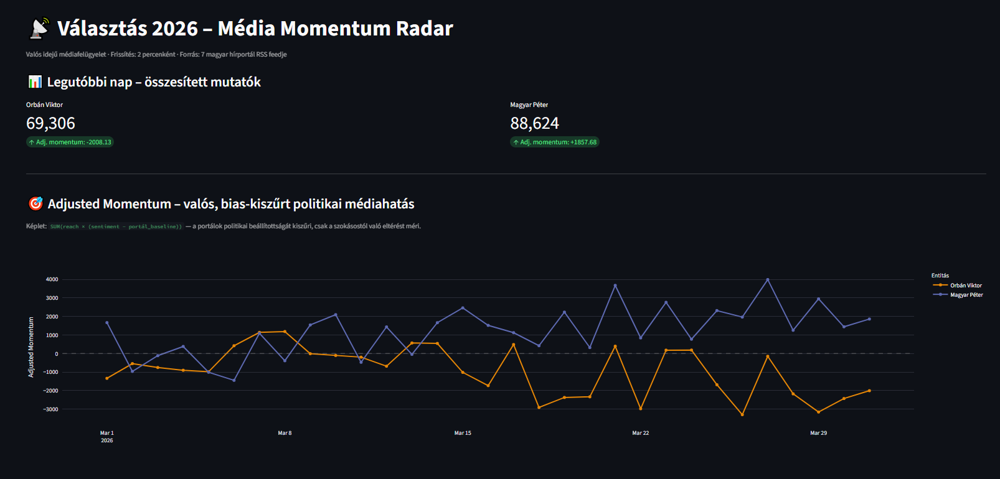
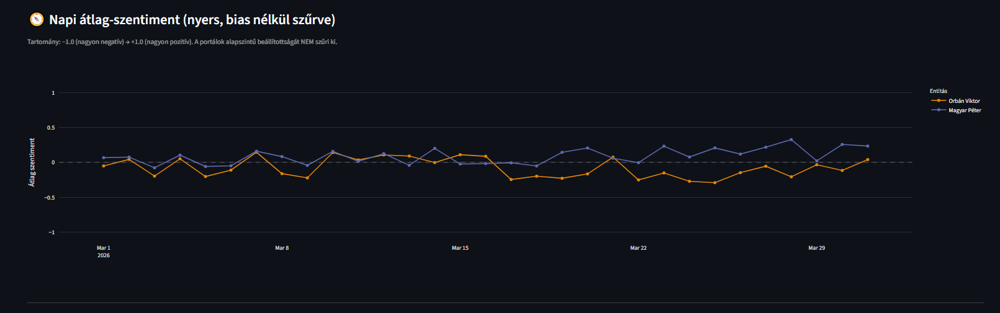
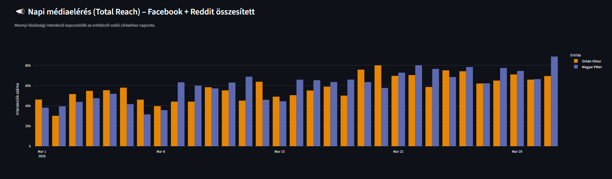

# Projekt 2026 — Média Momentum Radar

**Valós idejű, bias-kiszűrt politikai médiafigyelő és momentum-elemző rendszer.**

7 magyar hírportál RSS feedjét monitorozza, Aspect-Based Sentiment Analysis (ABSA) segítségével entitás-szintű hangulatelemzést végez, social media elérést gyűjt, majd egy portál-baseline szűrt **Adjusted Momentum** mutatóval méri a valós — propagandától tisztított — politikai médiahatást.

---

## Technológiai Stack

| Réteg | Technológiák |
|---|---|
| Konténerizáció | Docker, Docker Compose |
| Üzenetsor | Redis (task queue + process queue) |
| Adatbázis | PostgreSQL 16, SQLAlchemy (ORM + raw SQL), psycopg2 |
| Backend API | Python 3.11, FastAPI, Uvicorn |
| Frontend | Streamlit, Plotly, Pandas |
| NLP | HuggingFace — `NYTK/sentiment-ohb3-xlm-roberta-hungarian` |
| Web Scraping | feedparser, trafilatura, BeautifulSoup4 |
| Social Metrics | SharedCount API (Facebook), Reddit Search API |

---

## Architektúra

```
Scheduler ──► Redis ──► Scraper ──► Redis ──► Processor
  (10p)      task_queue   (14 RSS)  process_queue  (regex keyword
                                                      matching)
                                                          │
                                                          ▼
                                               article_entity_mentions
                                                          │
                                     ┌────────────────────┼────────────────────┐
                                     ▼                    ▼                    ▼
                            Sentiment Analyzer    Metrics Updater        Aggregator
                            (HuggingFace NLP)     (SharedCount+Reddit)   (14d baseline
                                     │                    │               adjusted momentum)
                                     │                    │                    │
                                     ▼                    ▼                    ▼
                            sentiment_score        article_metrics      daily_momentum
                                                                              │
                                                                              ▼
                                                                        Web API
                                                                        (FastAPI)
                                                                              │
                                                                              ▼
                                                                        Dashboard
                                                                        (Streamlit)
```

### Adatfolyam lépésről lépésre

1. **Scheduler** — 10 percenként `scrape_task` üzenetet küld a Redis `task_queue`-ba
2. **Scraper** — 7 portál RSS feedjét dolgozza fel, trafilatura-val kinyeri a cikkek szövegét, menti a `raw_articles` táblába, majd minden új cikk ID-ját beteszi a Redis `process_queue`-ba
3. **Processor** — Regex word-boundary kulcsszó-illesztéssel detektálja a politikai entitásokat, rögzíti az `article_entity_mentions` kapcsolótáblában
4. **Sentiment Analyzer** — Entitásonként, az összes előfordulás körüli ±50 szavas maszkolt kontextusablakokon HuggingFace NLP sentiment elemzést futtat, az eredmények átlagát menti
5. **Metrics Updater** — SharedCount API-n (Facebook) és Reddit-en keresztül social media interakciós metrikákat gyűjt, decay polling stratégiával
6. **Aggregator** — 14 napos portál-szintű baseline sentimenthez képesti eltérés alapján Adjusted Momentum-ot számol, menti a `daily_momentum` táblába
7. **Web API** — FastAPI REST végponton keresztül szolgálja ki a `daily_momentum` adatokat
8. **Dashboard** — Streamlit felület Plotly vizualizációkkal, 2 percenként frissül a Web API-n keresztül

---

## Quick Start

```bash
git clone <repo-url> projekt2026
cd projekt2026
docker compose up -d
```

A szolgáltatások:

| Szolgáltatás | Port | Leírás |
|---|---|---|
| Dashboard | 8501 | Streamlit vizualizációs felület |
| Web API | 8000 | FastAPI REST API (`/api/momentum/latest`) |
| pgAdmin | 5050 | PostgreSQL admin felület |

A rendszer indulás után azonnal elkezdi a cikkek gyűjtését. Az első értelmes adatok ~5-10 perc múlva jelennek meg (a sentiment és metrics pipeline-nak idő kell).

---

## Technikai Különlegességek

### Idempotens Adatbázis Inicializálás

Az `infra/db/` könyvtárban lévő SQL fájlokat a PostgreSQL konténer ABC sorrendben futtatja:

- `01_init.sql` — Séma létrehozása (6 fő tábla + 7 alapértelmezett portál seed)
- `02_seed.sql` — Entitások és kulcsszavak feltöltése (`political_entities`, `keywords`)

Minden `CREATE TABLE` `IF NOT EXISTS`-szel, minden `INSERT` `ON CONFLICT DO NOTHING`-gal történik. A konténer újraindítása vagy a volume törlése után a rendszer determinisztikusan, beavatkozás nélkül újraépíti magát.

### Cross-Entity Masking

A Sentiment Analyzer a kontextusablakok NLP modellbe küldése előtt kimaszkolja a **más entitásokhoz** tartozó kulcsszavakat egy neutrális `[MÁSIK_SZEREPLŐ]` tokenre.

Ha egy cikkben Orbán Viktor és Magyar Péter is szerepel, az Orbán Viktorra vonatkozó sentiment számításakor a "Magyar Péter", "MP", "Tisza Párt" kifejezések lecserélődnek — így a modell nem "szennyezett" szöveget kap, és a sentiment score valóban az adott entitásra vonatkozik.

Az összes előfordulás körüli ±50 szavas ablakok átlaga adja a végső score-t, nem csak az első említés.

### Adjusted Momentum (Bias-szűrt Médiahatás)

A hagyományos sentiment elemzés nem veszi figyelembe a portálok politikai beállítottságát. Egy kormányközeli portál alapesetben is pozitívabban ír OV-ról — ez nem hír, hanem baseline.

**Az Adjusted Momentum képlete:**

```
SUM(reach × (sentiment − portál_14_napos_baseline))
```

A rendszer minden portál-entitás párra kiszámolja a 14 napos átlagos sentimentet (baseline), majd a napi cikkek súlyozásánál ezt az eltérést használja. Így csak az számít, ami **eltér a megszokottól** — a valódi médiahatás.

### Frontend-Backend Szétválasztás

A Dashboard **nem csatlakozik közvetlenül az adatbázishoz**. Minden adat a Web API `/api/momentum/latest` REST végpontján keresztül érkezik, CORS engedélyezéssel. Ez lehetővé teszi:

- A dashboard és az API független skálázását
- Külső kliensek (mobil app, más dashboardok) csatlakozását
- Az adatbázis séma változásainak izolálását a frontendtől

---

## Módszertan — Data Science Részletek

### 1. Entitás-detekció: Regex Word-Boundary Matching

A Processor a `keywords` táblából betöltött kulcsszavakból entitásonként egyetlen kompakt reguláris kifejezést fordít előre. A kifejezések hossz szerint csökkenő sorrendben (greedy matching elkerülésére) kerülnek a mintába:

```
pattern_e = \b(k1|k2|...|kn)\b        (IGNORECASE)
```

Minden `ki` egy entitáshoz tartozó kulcsszó vagy alias (a `keywords.aliases` JSONB oszlopból). A `\b` szóhatár-biztosítás megakadályozza a fals pozitív substring találatokat (pl. `"fidesz"` nem illik `"fideszes"`-re, hacsak az nincs expliciten aliasként felvéve).

Az illesztés eredménye az `article_entity_mentions` kapcsolótáblába kerül: `(article_id, entity_id, matched_keyword)`.

### 2. Aspect-Based Sentiment Analysis (ABSA)

**Modell:** `NYTK/sentiment-ohb3-xlm-roberta-hungarian` — XLM-RoBERTa alapú, magyar nyelvre finomhangolt háromosztályos (negatív / semleges / pozitív) sentiment klasszifikátor.

**Kontextusablak kinyerés:** Egy cikken belül az adott entitás **összes** előfordulásához (`re.finditer`) tartozó ±50 szavas környezet kerül kivágásra:

$$
W_{e,a}^{(i)} = a[\,p_i - 50\ :\ p_i + 50\,], \qquad p_i = \text{wordPos}(\text{match}_i)
$$

**Cross-Entity Masking:** Mielőtt a modell megkapná a szövegrészletet, a **más entitásokhoz** tartozó összes kulcsszó lecserélődik egy neutrális tokenre:

$$
\tilde{W}_{e,a}^{(i)} = \text{mask}\bigl(W_{e,a}^{(i)},\ K_{\text{all}\,\setminus\,e}\bigr)
$$

ahol $K_{\text{all} \setminus \{e\}}$ az összes entitás kulcsszavainak uniója, kivéve az éppen vizsgált $e$ entitást. A maszkolás egyetlen regex `sub` művelettel történik:

```
pattern_mask = \b(other_k1|other_k2|...|other_kn)\b  →  [MASIK_SZEREPLO]
```

**Szentiment számítás:** A modell minden címkére valószínűséget ad (`top_k=None`). A score a pozitív és negatív osztály valószínűségének különbsége:

$$
s = P(\text{LABEL}_2) - P(\text{LABEL}_0) \in [-1.0,\ +1.0]
$$

ahol $\text{LABEL}_0 = \text{negatív}$, $\text{LABEL}_1 = \text{semleges}$, $\text{LABEL}_2 = \text{pozitív}$. A semleges osztály nem befolyásolja a score-t.

**Átlagolás:** Ha az entitás $N$-szer fordul elő a cikkben, a végső score a maszkolt ablakokon számolt score-ok számtani átlaga:

$$
S_{e,a} = \frac{1}{N} \sum_{i=1}^{N} s\bigl(\tilde{W}_{e,a}^{(i)}\bigr)
$$

### 3. Social Media Reach

A Metrics Updater két forrásból gyűjt elérési metrikákat:

$$
R(a) = \mathrm{FB}(a) + \mathrm{Reddit}_{\uparrow}(a) + \mathrm{Reddit}_{\leftrightarrow}(a)
$$

- **Facebook:** SharedCount API v1.0 — `total_count` vagy `share + comment + reaction`
- **Reddit:** Reddit Search JSON API — a legjobb találat `score` és `num_comments` értéke

A metrikák gyűjtése **decay polling** stratégiával történik — a frissebb cikkeket gyakrabban ellenőrzi a rendszer:

| Cikk kora | Frissítési gyakoriság |
|---|---|
| < 2 óra | 15 perc |
| 2–12 óra | 1 óra |
| 12–48 óra | 6 óra |

Ez azért fontos, mert a social media interakciók döntő része a publikálás utáni első órákban érkezik (virális növekedési szakasz).

### 4. Portal Baseline és Adjusted Momentum

A rendszer központi mutatója az **Adjusted Momentum**, amely kiszűri a portálok politikai beállítottságából adódó alapszintű torzítást.

**Portál Baseline (14 napos mozgó átlag):**

$$
B_{p,e} = \frac{1}{|A_{p,e,14}|} \sum_{a \in A_{p,e,14}} S_{e,a}
$$

ahol $A_{p,e,14}$ azon cikkek halmaza, amelyek a $p$ portálról származnak, tartalmazzák $e$ entitást, és az elmúlt 14 napban lettek scrapelve.

**Nyers Momentum (bias nélkül):**

$$
M_{e,d} = \sum_{a \in A_{e,d}} \bigl( R(a) \cdot S_{e,a} \bigr)
$$

ahol $A_{e,d}$ a $d$ napon scrapelt, $e$ entitást tartalmazó cikkek halmaza.

**Adjusted Momentum (bias-szűrt):**

$$
\tilde{M}_{e,d} = \sum_{a \in A_{e,d}} \bigl( R(a) \cdot (S_{e,a} - B_{\text{portal}(a),\,e}) \bigr)
$$

**Intuíció:** Ha egy kormányközeli portál átlagosan `+0.3` sentimenttel ír OV-ról (ez a baseline), akkor egy `+0.4`-es sentiment már csak `+0.1` adjusted értéket képvisel — hiszen a `+0.3` a "szokásos", nem valódi médiahatás. Fordítva: ha ugyanez a portál `−0.1` sentimentet produkál, az adjusted érték `−0.4`, ami jelentős negatív elmozdulást jelez a megszokotthoz képest.

Az aggregátor 10 percenként újraszámolja az elmúlt 3 nap adatait (`LOOKBACK_DAYS = 3`), az eredményt upsert-eli a `daily_momentum` táblába.

---

## Fő Funkciók

### Adjusted Momentum Vonal diagram

A bias-kiszűrt politikai médiahatás alakulása entitásonként. A 0 vonal feletti érték pozitív, az alatti negatív irányba mutató médiahatást jelez a baseline-hoz képest.



### Napi Átlag-Szentiment

Az entitásonkénti nyers átlagos sentiment alakulása (−1.0 és +1.0 között). Ez a portálok beállítottságát NEM szűri — a "nyers pulzus".



### Napi Médiaelérés (Total Reach)

Facebook + Reddit interakciók összesített száma entitásonként, naponta. Azt mutatja, mekkora közösségi média figyelem irányul az adott entitásra.



### Interaktív Szűrők

Entitás-szintű szűrés (multiselect) és dátumintervallum szűkítés a sidebar-on keresztül.

## Rendszerkövetelmények

- Docker 24+ és Docker Compose v2
- SharedCount API kulcs (opcionális, `.env`-ben: `SHAREDCOUNT_API_KEY`)
- ~4 GB szabad memória (a HuggingFace modell miatt)
- ~10 GB szabad lemezterület

---

## Projekt Struktúra

```
.
├── docker-compose.yaml
├── infra/db/
│   ├── 01_init.sql          # Séma + portál seed
│   └── 02_seed.sql          # Entitások + kulcsszavak
├── services/
│   ├── scheduler/            # Cron trigger (Redis task_queue)
│   ├── scraper/              # RSS feed → raw_articles
│   ├── processor/            # Regex keyword matching → article_entity_mentions
│   ├── sentiment_analyzer/   # HuggingFace NLP → sentiment_score
│   ├── metrics_updater/      # Social media metrikák → article_metrics
│   ├── aggregator/           # Adjusted Momentum → daily_momentum
│   ├── web_api/              # FastAPI REST API
│   └── dashboard/            # Streamlit vizualizáció
├── shared/
│   ├── config.py             # DB/Redis konfiguráció
│   ├── connections.py        # Retry-logikás kapcsolatkezelés
│   └── models/db_models.py   # SQLAlchemy ORM modellek
├── scripts/
│   ├── reset_scores.py       # Sentiment score-ok nullázása
│   └── verify_sentiment.py   # Sentiment ellenőrző lekérdezés
```
